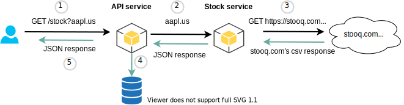

<div align="center">
    
</div>

# Python/Django Challenge

## Author
André Goveia

### API Service

The API service has been implemented according to the described requirements:

* **User and Super User Creation:** Django's built-in features have been used to create users and super users.
* **Authentication:** All endpoints in the API service require Basic Authentication. No anonymous requests are allowed.
* **Stock Quote Storage:** When a user makes a request to get a stock quote, if the stock is found, it is saved in the database associated with the user making the request.
* **API Response for Stock Quotes:**
  - **`GET /stock?q=aapl.us`**
    ```
    {
      "name": "APPLE",
      "symbol": "AAPL.US",
      "open": 123.66,
      "high": 123.66,
      "low": 122.49,
      "close": 123
    }
    ```
* **Query History:** Users can get their query history by accessing the history endpoint. The endpoint returns the list of entries saved in the database, showing the latest entries first:
  - **`GET /history`**
    ```
    [
        {"date": "2021-04-01T19:20:30Z", "name": "APPLE", "symbol": "AAPL.US", "open": "123.66", "high": 123.66, "low": 122.49, "close": "123"},
        {"date": "2021-03-25T11:10:55Z", "name": "APPLE", "symbol": "AAPL.US", "open": "121.10", "high": 123.66, "low": 122, "close": "122"},
        ...
    ]
    ```
* **Stats:** Only super users can access the stats endpoint, which returns the top 5 most requested stocks:
  - **`GET /stats`**
    ```
    [
        {"stock": "aapl.us", "times_requested": 5},
        {"stock": "msft.us", "times_requested": 2},
        ...
    ]
    ```
* **Response Format:** All endpoint responses are in JSON format.

### Stock Service

The stock service has been implemented according to the described requirements:

* **Authentication:** As this is an internal service, requests to endpoints in this service do not require authentication.
* **Stock Request Handling:** When a stock request is received, this service queries an external API to get the stock information. The external API used is: `https://stooq.com/q/l/?s={stock_code}&f=sd2t2ohlcvn&h&e=csv`. The `{stock_code}` should be replaced with the requested stock code.
* **List of Stock Codes:** A list of available stock codes can be seen here: [List of Stock Codes](https://stooq.com/t/?i=518).

## Architecture



1. A user makes a request for Apple's current stock quote: `GET /stock?q=aapl.us`.
2. The API service calls the stock service to retrieve the requested stock information.
3. The stock service delegates the call to the external API, parses the response, and returns the information back to the API service.
4. The API service saves the response from the stock service in the database.
5. The data is formatted and returned to the user.

## How to run the project
* Create a virtualenv: `python -m venv virtualenv` and activate it `. virtualenv/bin/activate`.
* Install dependencies: `pip install -r requirements.txt`
* Start the api service: `cd api_service ; ./manage.py runserver 0.0.0.0:8000`
* Start the stock service: `cd stock_service ; ./manage.py runserver 0.0.0.0:8001`
